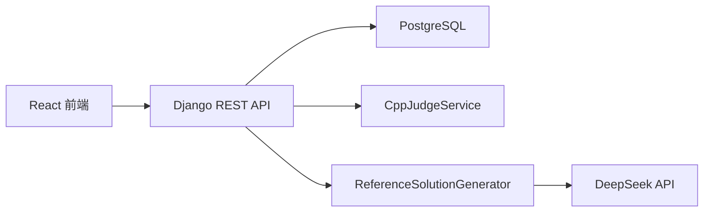

# 技术文档

## 1. 架构概览

系统采用前后端分离架构：

- 前端：React + TypeScript + Vite
- 后端：Django + Django REST Framework，使用 `uv` 管理依赖
- 数据库：PostgreSQL
- AI：DeepSeek，封装为可替换服务接口



## 2. 模块设计

### 2.1 `problems`

- `Problem`
- `SampleCase`
- `TestCase`
- `ProblemViewSet`
- `ReferenceSolutionGenerator`

### 2.2 `submissions`

- `Submission`
- `SubmissionViewSet`
- `CppJudgeService`

## 3. 关键接口

### 3.1 获取题目列表

`GET /api/problems/`

### 3.2 上传题目

`POST /api/problems/upload/`

### 3.3 提交代码

`POST /api/submissions/`

请求示例：

```json
{
  "problem": 1,
  "source_code": "#include <bits/stdc++.h>...",
  "language": "cpp"
}
```

## 4. 扩展设计

- 新语言支持：新增语言策略服务，不改动提交 API
- 新 AI 提供方：实现 `ReferenceSolutionGenerator` 协议即可
- 新判题方式：替换 `CppJudgeService` 或抽象出统一 Judge 接口

## 5. 当前限制

- 当前判题为同步执行
- 当前判题进程未做容器隔离
- 当前仅支持样例自动生成公开测试点
- 当前未实现用户登录和权限系统
- 当前运行环境需要提供可用的 C++ 编译器路径，默认值为 `g++`

## 6. 安全建议

- 生产环境必须使用容器沙箱执行用户代码
- 需要限制 CPU、内存、文件系统和系统调用
- 需要引入任务队列，避免阻塞 Web 请求
- 需要为上传题目接口增加鉴权和审计
